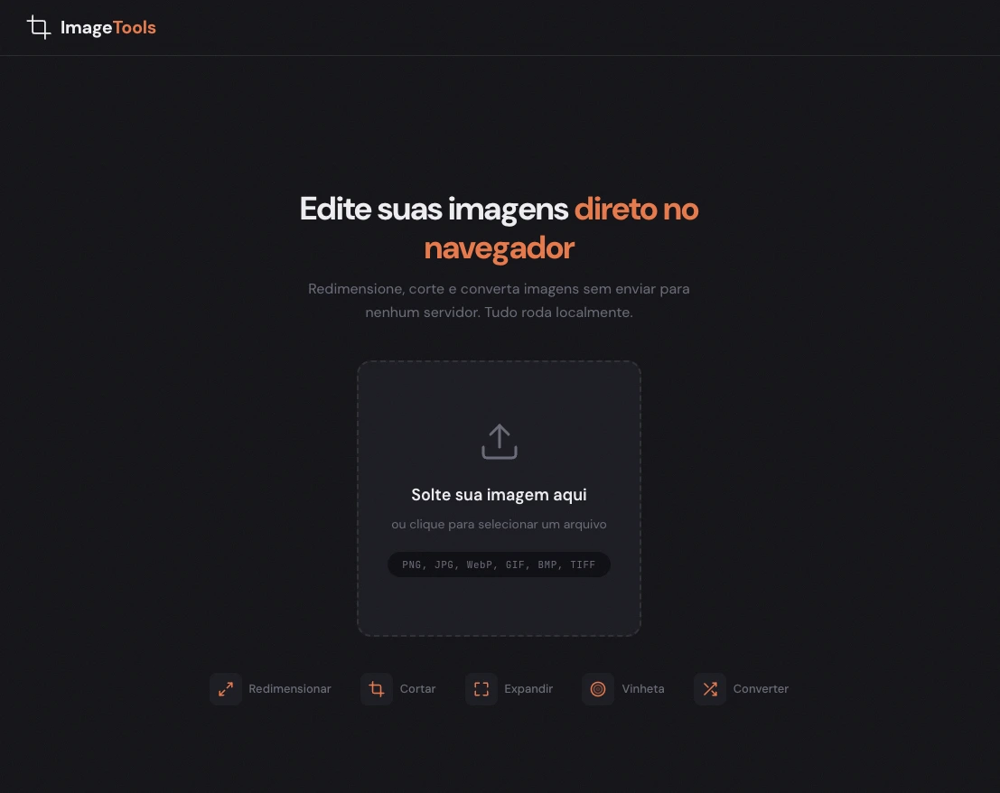

# ✨ Photara

**φῶς (phōs) - A Luz que Revela**

Photara (do grego phōs φῶς, "luz") — refere-se à luz primordial e essencial na mitologia grega, que ilumina o mundo e revela a beleza oculta das formas.

**Edite imagens com facilidade total, sem anúncios, sem login, sem cobranças e zero burocracia.**



---

## ✨ Por que Photara?

Cansado de ferramentas de edição de imagem que:
- 🚫 Exigem login e cadastro
- 🚫 Mostram propagandas a cada clique
- 🚫 Enviam suas imagens para servidores desconhecidos
- 🚫 São lentas e cheias de recursos desnecessários

**Photara** é diferente. É uma ferramenta **100% gratuita** que roda **completamente no seu navegador**. Suas imagens **nunca saem do seu computador**. Zero fricção, máxima privacidade.

---

## 🛠️ Funcionalidades

| Ferramenta | Descrição |
|------------|-----------|
| **🔄 Redimensionar** | Altere as dimensões da imagem mantendo ou não a proporção |
| **✂️ Cortar** | Selecione a área desejada e corte sua imagem |
| **↔️ Expandir** | Adicione bordas com cores personalizadas ao redor da imagem |
| **🌓 Vinheta** | Aplique efeito de vinheta para destacar o centro da imagem |
| **🔀 Converter** | Converta entre formatos PNG, JPEG e WebP com controle de qualidade |

Todas as ferramentas funcionam **instantaneamente** no seu navegador, sem uploads ou processamento em servidor.

---

## 🚀 Como usar

1. **Arraste e solte** uma imagem na área de upload ou **clique para selecionar**
2. **Escolha a ferramenta** que deseja usar na barra lateral
3. **Ajuste os parâmetros** em tempo real
4. **Visualize** as mudanças instantaneamente (alterne entre original e editada)
5. **Baixe** a imagem no formato que preferir

Simples assim. Sem tutoriais complicados, sem curva de aprendizado.

---

## 💻 Tecnologia

Construído com tecnologias modernas da web:

- **Vue 3** - Framework reativo e performático
- **Vue Router** - Navegação SPA
- **VueUse** - Coleção de composables utilitários
- **TypeScript** - Segurança de tipos
- **Canvas API** - Processamento de imagem no navegador
- **Vite** - Build tool ultra-rápido

Todo o processamento acontece no **client-side** usando a Canvas API do navegador. Nenhuma requisição HTTP é feita após o carregamento inicial da aplicação.

---

## 🏃 Rodando localmente

```bash
# Instalar dependências
npm install

# Rodar em modo de desenvolvimento
npm run dev

# Build para produção
npm run build
```

---

## 🔒 Privacidade

Suas imagens **nunca** são enviadas para nenhum servidor. Todo o processamento acontece localmente no seu navegador. Você pode até usar a ferramenta **offline** após o primeiro carregamento (se configurado como PWA).

---

## 📝 Licença

Este projeto é open-source e está disponível para uso livre.

---

## 🙌 Contribuindo

Contribuições são bem-vindas! Sinta-se à vontade para:
- Reportar bugs
- Sugerir novas funcionalidades
- Enviar pull requests

---

**Feito com ❤️ para quem valoriza simplicidade e privacidade.**
